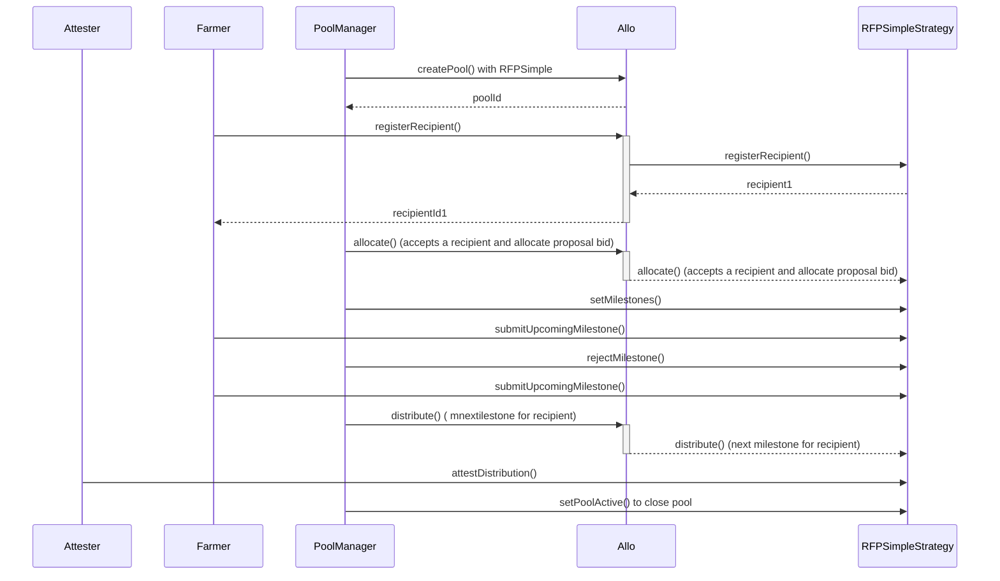

# EasyFarm
### Problem

- **Inadequate Financial Products**: Existing credit options do not meet the specific needs of small and medium-sized farmers.
- **Poor Risk Management**: Lack of transparency and reliable data complicates risk assessment.
- **Limited Traceability**: Difficulty in tracking and verifying the use of funds and milestone achievements.

### Solution

Implementing the `RFPSimpleStrategy` within the Allo protocol provides a decentralized, milestone-based funding system. This solution offers:

- **Pool Creation**: **PoolManager** sets up a funding pool using `RFPSimpleStrategy` to handle fund management and allocation.
- **Recipient Registration**: **Farmers** submit proposals to register as recipients. These proposals are verified and accepted by the strategy.
- **Milestone Management**: **PoolManager** defines milestones for the funding. **Farmers** submit proofs for milestone completion, which are reviewed and either approved or rejected.
- **Funding Distribution**: Funds are distributed according to milestone achievements. **Attesters** verify and attest each distribution to ensure proper use of funds.
- **Transparency**: The smart contract provides a clear record of all transactions, milestone statuses, and attestations, ensuring a transparent and accountable funding process.

This approach ensures a structured and reliable process for agricultural financing, addressing key issues of transparency and risk management.

## Funding strategy

