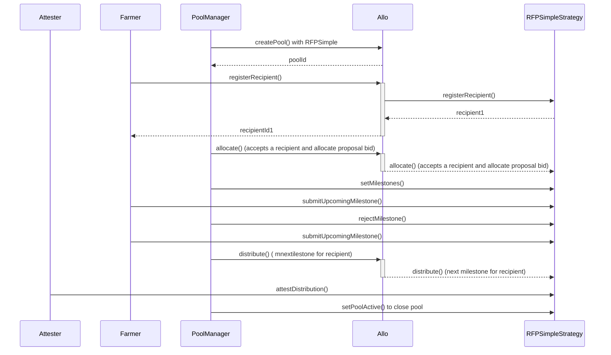

# EasyFarm

## Funding strategy

```mermaid
sequenceDiagram
    participant Attester
    participant Farmer
    participant PoolManager
    participant Allo
    participant RFPSimpleStrategy

    PoolManager->>Allo: createPool() with RFPSimple
    Allo-->>PoolManager: poolId
    Farmer->>+Allo: registerRecipient()
    Allo->>RFPSimpleStrategy: registerRecipient()
    RFPSimpleStrategy-->>Allo: recipient1
    Allo-->>-Farmer: recipientId1
    PoolManager->>+Allo: allocate() (accepts a recipient and allocate proposal bid)
    Allo-->>-RFPSimpleStrategy: allocate() (accepts a recipient and allocate proposal bid)
    PoolManager->> RFPSimpleStrategy: setMilestones()
    Farmer->> RFPSimpleStrategy: submitUpcomingMilestone()
    PoolManager->> RFPSimpleStrategy: rejectMilestone()
    Farmer->> RFPSimpleStrategy: submitUpcomingMilestone()
    PoolManager->>+Allo: distribute() ( mnextilestone for recipient)
    Allo-->>-RFPSimpleStrategy: distribute() (next milestone for recipient)
    Attester->>RFPSimpleStrategy: attestDistribution()
    PoolManager->>RFPSimpleStrategy: setPoolActive() to close pool
```
